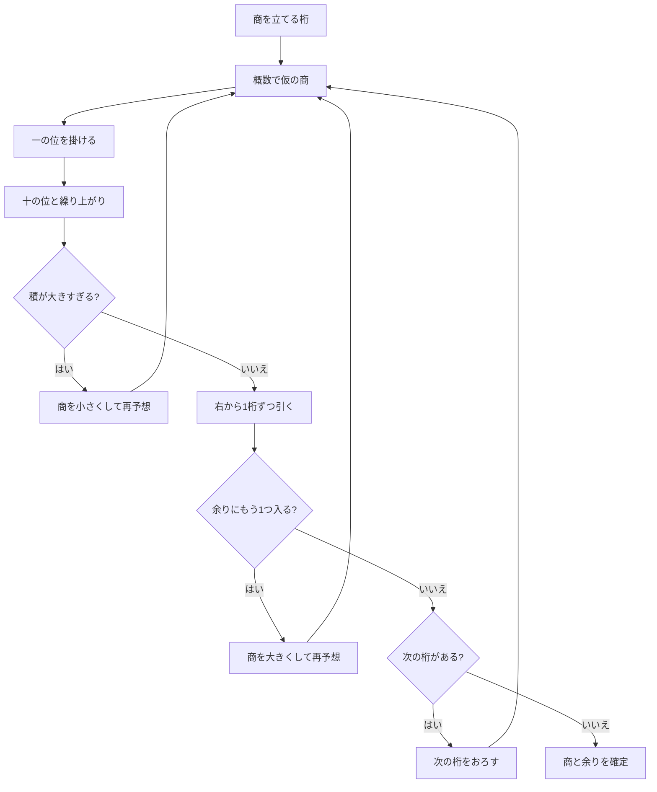

# ギリギリバトル 開発引き継ぎ書 v0.8

更新日: 2026-09-21  
対象リポジトリ: `harukatakehara0113/kids_warizan`  
対象ブランチ: `main`  
対象アプリ: `battle/index.html`  
公開URL: <https://harukatakehara0113.github.io/kids_warizan/battle/?v=boss-v08>

## 1. 最初に読む要約

- 小学校4年生向けに、遊びながら「数の近さ → 概数 → 商立て → 筆算の一連の手順」を身につけるWebゲーム。
- 現行表示バージョンは **v0.8**。`v8.0` ではない。
- ビルド不要の単一HTMLアプリ。主要実装は `battle/index.html` のHTML/CSS/JavaScriptに集約されている。
- 公開はGitHub Pages。`main` へマージするとPagesのデプロイが走る。
- 開発は原則として **作業ブランチ → PR → ユーザー確認 → ユーザーがマージ** の順。
- 最新のPRは [#12 商を立てる場所の選択を確実にする](https://github.com/harukatakehara0113/kids_warizan/pull/12)。
- v0.7で、iPhone上のボス戦最初の「？」が押せないとユーザーから報告があった。v0.8では二重導線に直したが、**v0.8公開後の実機再確認結果はまだ受け取っていない**。次セッションで最優先に確認する。

## 2. プロダクトの目的

正解だけを暗記させるのではなく、子どもが数字の関係を見て、途中の考え方を自然に反復できることが目的。

学習の流れは次の4段階。

1. 弱: 数字どうしの近さを感じる
2. 中: 数を丸め、商をざっくり見立てる
3. 強: 左から見る範囲を決め、商を立てる
4. ボス: 筆算を最初から最後まで一連でつなぐ

大切な設計原則:

- 間違えてもHPや進捗を減らさない。同じ問題ですぐ再挑戦できる。
- 答えだけでなく、「今どの数字を使っているか」「なぜ直すか」を見せる。
- 筆算では、使い終わった数字も消さず、一連の形を見続けられるようにする。
- 現在使う数字だけを色と動きで強調する。
- 子どもが迷いやすい操作は、小さい図上操作だけに依存せず、大きな回答ボタンも用意する。

## 3. ビジュアルとトーンの合意事項

### 配色

- 最背面: ニュートラルグレー
- 通常時の主色: ビビッドなコバルトブルー
- 通常時の差し色: 蛍光イエローグリーン
- 面積感: **主色 9 : 差し色 1**
- 敵: モノクロ中心、太線、少色
- イベントの瞬間だけ色を追加する
  - ヒント: イエロー
  - 成功: ライム
  - 再挑戦: コーラル
  - 撃破: パープル

通常画面を多色にしすぎず、出来事の短いフラッシュとして色を使う。

### キャラクターと文章

- 日常の困りごとを擬人化した敵。
- 太線、シンプルな形、大きな表情。
- 短い脱力系・少しシニカルな台詞。
- 特定作品やキャラクターを直接コピーしない。
- 現在の敵:
  - 弱: まだ湿ってるTシャツ
  - 中: 終わらない宿題プリント
  - 強: 親に替えられたパスワード
  - ボス: 1円もまけない割り勘レジ

### 画面

- 主対象はiPhone縦画面。
- 弱・中・強は一画面での把握を重視。
- ボスは筆算全体を残すため、必要なら縦スクロールを許容する。
- タップ領域は最低48px級を意識する。

## 4. 現在のモード仕様

| モード | 学習テーマ | 現在の動き | 撃破条件 |
|---|---|---|---|
| 弱 | 数の距離感 | 狙いの数そのものは選択肢に出さず、最も近い数字を選ぶ。数直線で距離を確認 | 5回成功 |
| 中 | 概数と仮の商 | 例 `68÷23` を `70÷20` と見立てる。近い10を選ぶミニゲーム、仮商、本当の数での掛け戻し、必要なら1つ下げる | 5回成功 |
| 強 | 見る範囲と商立て | 割られる数を左から見て、割る数が初めて入る部分被除数を決める。候補の積と量ブロックで商を確認 | 5回成功 |
| ボス | 筆算の全手順 | 桁、見立て、掛け算、引き算、比較、次の桁をつなげる | その問題の商の各桁を完成 |

### 弱モード

- 狙い値は概ね18〜82。
- 候補は狙い値から異なる距離に生成され、狙い値と同じ値は出さない。
- 最短距離の候補を選ぶ。
- 誤答時は距離を見せ、別候補を選べる。

### 中モード

- 固定問題セットは8問。
- ヒント1は「一の位を薄くする」だけではなく、近い10を選ぶ操作。
  - 例: 68は60と70のどちらに近いか。
  - 正解した概数を元の数字の上に表示。
  - 割られる数と割る数の両方を丸める。
- ヒント2で概数の式を表示。
- ヒント3で概数を量ブロックとして表示。
- 本回答後は実数に戻し、掛け戻して仮商を調整する。
- 一の位が5の将来問題に備え、四捨五入では大きい方と案内できる分岐がある。

### 強モード

- 固定問題セットは12問。
- 「何回足すと？」という繰り返し加算の説明は使わない。
- 左から桁を増やし、割る数以上になる最初のまとまりを見つける。
- ヒントの順番:
  1. 見る範囲を選ぶ
  2. 候補の掛け算を比較する
  3. ブロックで個数と余りを確認する

## 5. ボス戦 v0.8

### 5.1 出題順

ボス問題はランダムではなく、次の順で循環する。

| 順 | 問題 | 答え | 狙い |
|---:|---|---|---|
| 1 | `224÷28` | `8` | 商を1回立てる、`8×8=64` の繰り上がり |
| 2 | `672÷28` | `24` | 商を2回立てる |
| 3 | `3528÷24` | `147` | 4桁、3サイクル |
| 4 | `2828÷28` | `101` | 商の途中に0が入る |
| 5 | `2534÷32` | `79余り6` | 最後に余りが残る |

現状の掛け算UIは **2桁の割る数** を前提にしている。一の位と十の位を別ステップで処理するため、3桁以上の割る数を追加する場合は一般化が必要。

### 5.2 状態遷移

補足:

- 最初のサイクルだけ「商を立てる桁」から始まる。
- 2桁目以降は、前の余りへ次の桁をおろしたあと「概数で仮の商」へ進む。
- 一の位の掛け算に正解すると、答えと繰り上がりを約720ms表示して十の位へ自動遷移する。
- 積が部分被除数より大きい場合は、引き算せずに商を小さくする。
- 積が引ける場合は、実際に右から1桁ずつ引いてから、余りに割る数がもう1つ入るかを判断する。
- 商が小さすぎた場合は、計算した余りを根拠に商を大きくしてやり直す。

### 5.3 筆算表示のルール

- 商、割る数、割られる数、積、差、下ろした数字を同じ筆算ボードへ残す。
- 現在使う商と数字を色で対応させる。
- 一の位の掛け算後、積の一の位を書き、繰り上がりを左上へ小さく残す。
- 十の位では「十の位×商＋繰り上がり」を表示する。
- 引き算は右から1桁ずつ。
- そのまま引けない場合は「左の位から1をかりる」を独立操作にする。
- 借りて書き換えた数は筆算上に小さく残す。
- どの数字を掛ける・引くか迷わないよう、現在使うセルを強調し続ける。

### 5.4 v0.8の位選択修正

v0.7で、最初の「どの桁に商を立てる？」にある筆算上の `?` がiPhoneで押せないと報告された。

v0.8では次の二重導線に変更した。

1. 筆算上の `?` 自体を、ほかの回答と同じ `data-boss-action="place"` の直接イベントで動かす。
2. 回答欄にも大きな「百の位／十の位／一の位」ボタンを出す。

上下どちらを押しても `chooseBossPlace(index)` へ入り、同じ判定になる。誤って選んだ位は上下とも再選択不可の表示にする。

**重要:** コード上の経路と全5問の自動状態遷移は確認済みだが、v0.8をiPhone実機で押せたというユーザー確認はまだない。

## 6. 実装構成

### ファイル

- `battle/index.html`
  - 現行ゲーム本体。
  - HTML、CSS、問題データ、状態管理、描画、効果音をすべて含む。
- `index.html`
  - リポジトリ直下の別ページ。ボス戦の変更対象ではない。
  - 明示的な依頼がない限り、`battle/index.html` と取り違えない。
- `README.md`
  - リポジトリ概要と本引き継ぎ書への入口。

### 主なデータと関数

- `modeOrder`: `weak / mid / strong / boss`
- `enemies`: 敵名、台詞、撃破文言
- `midProblems`: 中モード問題
- `strongProblems`: 強モード問題
- `bossProblems`: ボス5問
- `buildDivisionSteps(a, b)`: 筆算の商の各桁、積、余り、次の桁を事前計算
- `makeBoss()`: ボス状態の初期化
- `bossDivisionBoard()`: 筆算ボード全体の描画
- `bossPanel()`: 現在ステップの説明パネル
- `bossChoices()`: 現在ステップの回答ボタン
- `attachBossHandlers()`: ボス回答のイベント接続
- `chooseBossPlace()`: 商を立てる桁の判定
- `chooseBossEstimate()`: 仮の商の設定
- `chooseBossCalculation()`: 一の位／十の位の掛け算
- `buildSubtractionPlan()`: 右から行う引き算と借りる処理の計画
- `chooseBossBorrow()` / `chooseBossSubtraction()`: 引き算操作
- `chooseBossVerdict()`: 積過大、商過小、適正の判定
- `chooseBossBringDown()`: 次の桁をおろす
- `beginBossPhase()` / `bossNext()`: フェーズ遷移
- `bossHint()`: フェーズ別3段階ヒント

### 状態管理上の注意

- 状態はページ内メモリだけ。再読み込みすると進捗は消える。
- DOMは各回答後に `innerHTML` で再描画され、回答イベントも付け直される。
- `bossAutoTimer` が一の位から十の位への自動遷移を管理する。フェーズ変更時に必ず解除する。
- `bossRun.completedDigits` と `bossRun.history` が、完成した商と過去の筆算行を保持する。
- `bossRun.phaseAttempts` は現在フェーズの誤答、`attemptedQs` は仮商の再試行制御。

## 7. 現在確認できていること

v0.8作成時に次を確認済み。

- JavaScript構文チェック
- 筆算上の `?` と下の大きな位ボタンが同じ処理を呼ぶこと
- ボス全5問を最初から最後まで通過する状態遷移
- 借りる引き算
- 商の途中に0が入る問題
- 最終的に余りが出る問題
- GitHubへ反映したファイルと検証済みローカルファイルの一致
- PR #12マージ後のGitHub Pagesデプロイ成功

ブラウザ自動テスト環境やテストファイルは、現時点ではリポジトリに置いていない。上記は開発時の構文・ロジック・状態遷移確認であり、iPhone Safari／ChatGPT内ブラウザの実機E2Eを代替しない。

## 8. 次セッションの最優先事項

### 8.1 まずv0.8の実機確認

公開URLをiPhoneで開き、ボス戦の最初で次を確認する。

- 下の大きな「百の位／十の位／一の位」が見える。
- 下の大きな位ボタンを押せる。
- 筆算上の `?` も押せる。
- どちらから選んでも同じフィードバックになり、「見立てへ」進める。
- 以前のキャッシュを避けるため、URL末尾の `?v=boss-v08` を残す。

もしまだ押せない場合、まず次を切り分ける。

1. 下の大きな位ボタンも押せないか、上の `?` だけ押せないか。
2. iPhone Safariか、ChatGPTアプリ内ブラウザか。
3. ほかのモードの数字ボタンは押せるか。
4. ボタンの上に透明要素が重なっていないか。
5. `disabled` が意図せず付いていないか。
6. `attachBossHandlers()` が再描画後に実行されているか。

### 8.2 次の改善候補

以下はアイデアであり、ユーザー合意済み仕様ではない。着手前に優先順位を相談する。

1. ボスの途中で「今の1手」を戻す／最初からやり直す操作
2. 子どもが迷った箇所を特定する簡単なプレイ履歴
3. 720msの自動遷移速度を調整可能にする、またはタップでも進める
4. ボス問題の追加と難易度カーブの整理
5. 3桁の割る数にも対応できる掛け算ステップの一般化
6. 完了画面に「今日使えた考え方」を短く振り返る表示
7. 単一HTMLが大きくなっているため、仕様が安定した段階でCSS/JS/テストを分割

## 9. 変更時に守ること

- `main` を直接編集せず、作業ブランチとPRを使う。
- 既存の学習順序を変更する場合は、見た目だけでなく「何を考えさせるか」を説明する。
- 小さい筆算セルだけを必須操作にしない。
- 数字の強調は、現在使う数字同士の対応が分かるようにする。
- 誤答で進捗を失わせない。
- iPhone縦画面を最初に確認し、4桁筆算では縦スクロールを許容する。
- 平常時の9:1配色を維持し、イベント色を常設色にしない。
- `battle/index.html` の変更で、弱・中・強へ回帰不具合を入れない。
- バージョン番号を上げる場合、`<title>` と画面内ブランド表示を両方そろえる。
- 公開確認ではキャッシュ回避用クエリも更新する。例: `?v=boss-v09`。

## 10. PR履歴

- [#4 v0.3: 近さ・見立て・商の3段階](https://github.com/harukatakehara0113/kids_warizan/pull/4)
- [#5 v0.4: 敵の5段階変化とゲームループ](https://github.com/harukatakehara0113/kids_warizan/pull/5)
- [#6 グレー背景・9:1配色と概数ヒント](https://github.com/harukatakehara0113/kids_warizan/pull/6)
- [#7 近い10の概数ミニゲームとイベント色](https://github.com/harukatakehara0113/kids_warizan/pull/7)
- [#8 強モードの見る範囲と商立て](https://github.com/harukatakehara0113/kids_warizan/pull/8)
- [#9 ボス戦追加](https://github.com/harukatakehara0113/kids_warizan/pull/9)
- [#10 筆算の一連表示、掛け算・引き算の段階化](https://github.com/harukatakehara0113/kids_warizan/pull/10)
- [#11 タップ対策、掛け算自動遷移、引いてから比較](https://github.com/harukatakehara0113/kids_warizan/pull/11)
- [#12 v0.8: 位選択の二重導線](https://github.com/harukatakehara0113/kids_warizan/pull/12)

## 11. 次セッションへ渡すプロンプト

次の文章を、新しいセッションの最初にそのまま渡せる。

> GitHubリポジトリ `harukatakehara0113/kids_warizan` のWebゲーム「ギリギリバトル」の開発を続けたいです。まず `docs/HANDOVER_v0.8.md` を最後まで読み、GitHubの `main` と公開ページを確認してください。現行はv0.8です。最初に、ボス戦の「商を立てる場所」がiPhone実機で押せるかという未完了確認を扱ってください。変更が必要な場合は `main` を直接編集せず、ブランチを作り、既存の弱・中・強・ボスを回帰確認してPRを作ってください。デザインはグレー最背面、コバルト主色とライム差し色9:1、敵はモノクロ中心、イベント時だけ色を増やす方針を維持してください。

## 12. 現行基準点

- v0.8反映PR: [#12](https://github.com/harukatakehara0113/kids_warizan/pull/12)
- v0.8 `main` マージコミット: `69426f429f2e350a5d3789919765fc992b5da7bb`
- v0.8時点 `battle/index.html` blob: `2c4a82ae6eaac71bc2ffc5c2f072810216ea742e`
- Pagesデプロイ: 成功済み

今後 `main` が進んだ場合、この節のSHAより新しいGitHub上の内容を正とする。
